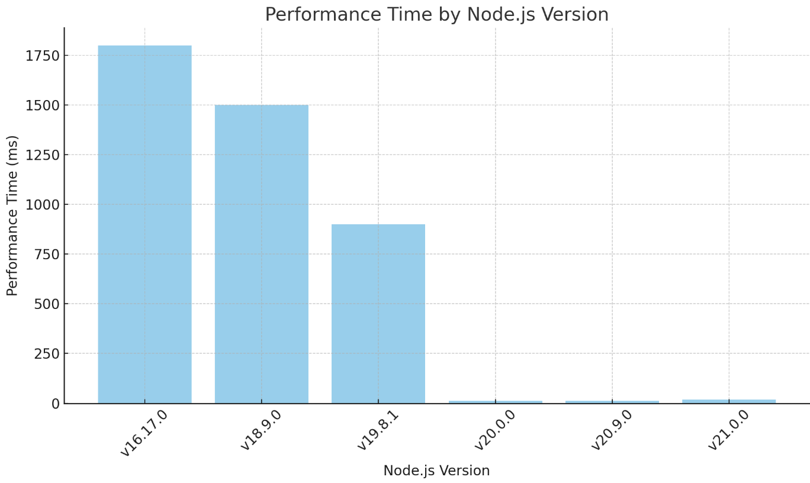

# Node Benchmarking

## Statistics

Using **v20.0.0**:

- 1 000 000 000 Operations
  Without Threads: 900ms
  2 Threads: CRASH (maps are huge)
  8 Threads: Too long
  NO RESULT RETURNED + NO MAP / ARRAY & using threads: 250ms

- 10 000 000 Operations
  Without Threads: 20ms
  8 Threads: 16000ms
  2 Threads: 24000ms

- 1 000 000 Operations
  Without Threads: 10ms
  8 Threads: 950ms

v21.0.0 doesn't make that much of a difference using threads.

v19.8.1, v18.9.0, v16.17.0 so < v20.0.0 too long, not interesting.
